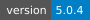
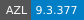
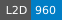

# AzurLane







Azur Lane Resources extracted and parsed by [Fernando2603/Azurex](https://github.com/Fernando2603/Azurex)

> [!IMPORTANT]
> Only `EN` server assets are available

> [!CAUTION]
> This repository is quite large, and it's not recommended to clone it entirely.
> Instead, consider fetching the JSON file or using a [sparse checkout](/docs/SPARSE_CHECKOUT.md).

> [!TIP]
> The repository will check for updates every day at `23:00 UTC`.

> [!NOTE]
> The dataset itself doesn't have version control, but it sync with the current game version.


## Docs
- [CHANGELOG](/docs/CHANGELOG.md)
- [BGM](/docs/BGM.md)
- [SKIN](/docs/SKIN.md)
- [SKILL](/docs/SKILL.md)
- [EQUIPMENT](/docs/EQUIPMENT.md)
- [MEOWFFICER](/docs/MEOWFFICER.md)
- [VOICELINE](/docs/VOICELINE.md)
- [list of missing voiceline audio](/docs/MISSING_VOICELINE.md)
- [git sparse-checkout how-to](/docs/SPARSE_CHECKOUT.md)


## Fetch (Only maintained dataset are included here)
```
https://raw.githubusercontent.com/Fernando2603/AzurLane/main/bgm.json
https://raw.githubusercontent.com/Fernando2603/AzurLane/main/bgm_link.json
https://raw.githubusercontent.com/Fernando2603/AzurLane/main/equipment.json
https://raw.githubusercontent.com/Fernando2603/AzurLane/main/equipment_icon.json
https://raw.githubusercontent.com/Fernando2603/AzurLane/main/equipment_skill.json
https://raw.githubusercontent.com/Fernando2603/AzurLane/main/meowfficer.json
https://raw.githubusercontent.com/Fernando2603/AzurLane/main/meowfficer_list.json
https://raw.githubusercontent.com/Fernando2603/AzurLane/main/meowfficer_talent.json
https://raw.githubusercontent.com/Fernando2603/AzurLane/main/meowfficer_talent_list.json
https://raw.githubusercontent.com/Fernando2603/AzurLane/main/ship_skin.json
https://raw.githubusercontent.com/Fernando2603/AzurLane/main/ship_skin_list.json
https://raw.githubusercontent.com/Fernando2603/AzurLane/main/skill.json
https://raw.githubusercontent.com/Fernando2603/AzurLane/main/skill_icon.json
https://raw.githubusercontent.com/Fernando2603/AzurLane/main/skin.json
https://raw.githubusercontent.com/Fernando2603/AzurLane/main/skin_list.json
https://raw.githubusercontent.com/Fernando2603/AzurLane/main/voiceline.json
https://raw.githubusercontent.com/Fernando2603/AzurLane/main/voicelink.json
```

## Replace Missing File (Wild Card)
- [unknown.json](https://github.com/Fernando2603/AzurLane/blob/main/unknown.json)
```
https://raw.githubusercontent.com/Fernando2603/AzurLane/main/unknown.json
```
